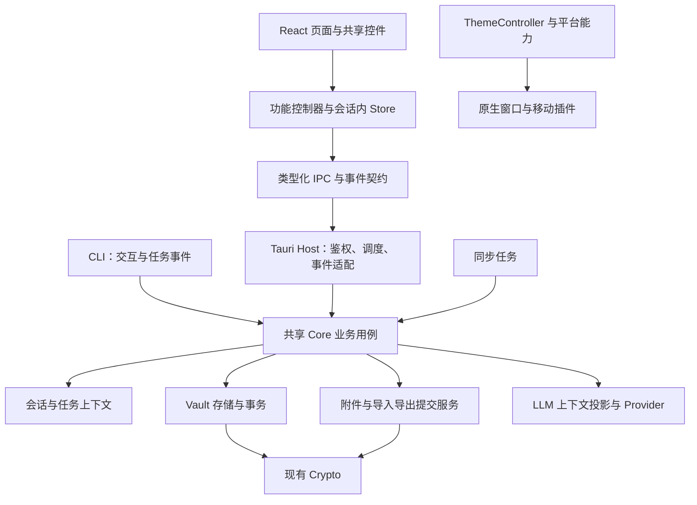

# SoloSoul 全栈调查与重构建议

日期：2026-09-25。代码基线：`f77c0e20` 及调查时的本地工作树。

本轮只调查并形成方案，没有修改业务代码，没有接入 Cua，没有提交或推送。

## 1. 结论

建议保留 **React + Zustand + CSS Modules + Tauri + 现有 Rust crates**，采用渐进重构。当前最需要解决的是规则和生命周期在不同入口间分叉，随后才是目录、组件和文件组织。

优先处理三类问题：

1. **数据与会话边界**：异步任务返回时重新取得另一个账户的 Vault；搜索和聊天未完整隔离迟到响应；LLM 上下文只过滤对象等级，没有过滤字段等级。
2. **写入完整性与跨端一致性**：回滚、备份在 GUI/CLI 间分叉；云快照遗漏附件；导出、导入、附件删除缺少完整的失败提交契约。
3. **前端与平台职责**：主题存在多个写入者和不同解析结果；部分代码将移动端等同 Android；平台 CSS 的覆盖关系仍依赖历史选择器。

这些问题不需要更换技术栈。继续机械拆分文件，也不能解决上述边界问题。

## 2. 调查范围与证据强度

覆盖前端启动、路由、常驻壳、状态、IPC、主题与控件；Tauri Commands、共享 core、Vault 存储、加密、导入导出、附件、LLM、OCR、同步、插件；CLI、原生平台桥接、构建、测试、CI 和架构文档。

采用目录与依赖配置盘点、关键调用链深读、GUI/CLI 对照、现有测试检查和本地基础验证。不是逐行形式化审计；本轮没有使用真实用户 Vault，没有向 LLM 发送数据，没有完成全部 Rust 测试、目标平台构建或原生设备验收。

本文区分：

- **确认代码行为**：分支、调用参数、序列化结构或提交顺序可以直接证明；不等于故障场景已在设备上复现。
- **条件风险**：给出触发条件和完整调用链，仍需屏障、故障注入或设备测试确认实际表现。
- **结构建议**：旨在减少维护成本，不宣称当前必然出错或性能不足。

### 2.1 当前规模

按指定源码目录中的 TS、TSX、CSS、Rust 文件统计，包含注释、空行和目录内测试；不包含依赖、JSON 资源、Kotlin/Swift、生成产物。

| 范围 | 文件数 | 行数 |
| --- | ---: | ---: |
| React 前端 `tauri/src` | 705 | 116,532 |
| Tauri Host `tauri/src-tauri/src` | 100 | 42,802 |
| `solosoul-core` | 41 | 20,253 |
| `solosoul-vault` | 19 | 15,766 |
| `solosoul-plugin` | 17 | 6,987 |
| `solosoul-sync` | 15 | 6,493 |
| `solosoul-crypto` | 6 | 929 |
| CLI `solosoul_cli/src` | 79 | 19,787 |
| 合计 | 982 | 229,549 |
| 另计 `tauri/e2e` | 34 | 6,660 |

前端有 139 个 `.test.ts(x)` 文件、19 个非测试 store 文件和 74 个 CSS 文件。当前最大的业务 TSX 约 701 行，不能根据旧报告将前端概括为尚未拆分的巨型单文件。CLI 的 `app.rs` 约 3,969 行，但应先分离任务和状态职责，再考虑文件拆分。

### 2.2 应保留的基础

- 已有统一 IPC 入口、ACL 命令检查、设置键一致性检查和会话请求工具；主要 store 已有迟到响应回归测试。
- 已有常驻 Shell、共享 Button/Checkbox/敏感度标记等控件，以及原生窗口更新的串行化处理。
- Rust 已按存储、密码学、同步、插件和核心逻辑拆成 crates；附件加密、部分导出导入逻辑已共享。
- 插件已有会话期限、锁定复核、WASM fuel、HTTP/安装取消；设备同步已有停机宽限。不能重新登记为“完全没有取消或沙箱”。
- GUI 和 CLI 均已有 CI 测试；Android 有独立构建，PR 有 iOS 目标检查。浏览器 E2E、Android 原生玻璃回归测试也已存在。

## 3. 优先处理的正确性问题

优先级：**P1** 表示应先于大范围结构调整处理的数据、隐私或明显功能问题；**P2** 表示随后处理的正确性或维护问题；**P3** 表示先测量再决定。

### R01 · P1：后端异步操作绑定原始账户会话

**证据与影响：**`commands/llm/stream.rs:435` 等待网络后，在 `:500` 重新从全局服务获取当前 Vault，但保留旧 `account_id`；`solosoul-vault/src/storage/conversations.rs:58` 没有校验传入账户属于该 Vault。A 请求期间锁定并登录 B，旧回复存在写入 B 数据库的调用链。`sync/cloud_auto_sync.rs:759` 的导入与 `:789` 的水线更新也重新获取当前 Vault。属于已确认调用链、待受控并发复现的高优先级风险。

**建议：**引入共享 `SessionContext { account_id, generation, vault }`，任务开始时一次取得；锁定/切换使旧代次失效，提交与事件发出前再次校验。校验与提交须由同一短临界区或等价机制保护，避免二者之间再次切换账户；前端也应丢弃旧代次事件。存储层补账户归属防线。仅捕获旧 `Arc` 不足以表达“锁定后禁止继续提交”，也不应通过持全局读锁跨网络来阻塞锁定。

**验收：**暂停 A 的网络响应，登录 B 后放行；B 的数据库、会话、统计、水线均不变；旧任务返回明确的失效状态。分别覆盖 LLM、云导入和水线提交。

### R02 · P1：搜索和聊天统一请求生命周期

**证据与影响：**`lib/searchShared.tsx:310` 的异步搜索在完成后直接写缓存和结果，`:348` 缺少账户/查询代次守卫；锁定清空缓存后，旧请求仍可能重新填入结果。`pages/search/SearchPage.tsx:149` 清空输入不使待执行查询失效。聊天 `hooks/useLlmChatCore.ts:119` 加载会话没有 latest-request 守卫；`hooks/useLlmStreaming.ts:48` 将全局流更新到当前最后一条 assistant，`:85` 又按旧流的会话 ID 保存；`ConversationSidebar.tsx:99` 允许生成中切换会话。

**建议：**搜索收敛到 `useUnifiedSearch`，复用已有 `sessionRequests`，统一 debounce、过滤条件、清空、缓存与结果写入。聊天以 `accountId + conversationId + requestId` 标识数据和事件；明确最终回复由后端持久化，前端只更新对应投影，避免两个写入者竞争。

**验收：**A/B 查询倒序返回、清空后返回、锁定后返回；A 生成时切 B、快速切换会话、同时使用快捷聊天。搜索与聊天是两个独立修复提交。

### R03 · P1：LLM 自动上下文需要字段级出站筛选

**证据与条件：**`lib/llm/systemPromptBuilder.ts:48` 只筛选对象级 public，`:58` 直接遍历属性；`commands/object/mod.rs:836` 可以单独把对象设为 public，同时保留字段标签与 `__fields`。因此，当已加载的 public 对象包含 sensitive/critical 等非 public 字段时，字段可能进入自动提示词；使用远程 provider 才构成向外部服务传输。新对象默认 internal，本轮未确认普通编辑页面存在 public 切换入口，不能推断所有聊天都会触发。

`hooks/useLlmChatCore.ts:179` 还将 API key 从 Rust 取回 WebView，随后再传给发送命令，扩大了密钥经过的组件范围。

**建议：**在 Rust 构建受控的 `LlmContextProjection`：统一解析对象/字段等级，排除内部元数据，未知标签默认不外发，递归处理动态字段。前端传 provider ID、会话 ID、用户输入和上下文选择；Rust 解析 provider 凭证和自动附加数据。用户主动输入的文本与自动附加的 Vault 数据应分清来源。先补字段过滤，再独立迁移凭证解析，避免一次改完整聊天协议。

**验收：**public 对象含四级字段、缺失标签、旧模板删除、动态组、内部键等情况下，捕获最终出站请求；自动上下文只含明确允许的字段。普通发送路径不再往返 API key。

### R04 · P2：聊天请求重复追加本次用户消息

**证据：**`useLlmChatCore.ts:144` 已把当前输入加入 `updatedMessages`，`:187` 将其作为 history 传入；`lib/llm/chatRequest.ts:30` 关闭提示词时再次追加 text；开启提示词时 `systemPromptBuilder.ts:175` 也再次追加。实际请求尾部是两条相同 user 消息。

**建议与验收：**明确 builder 接收“本次输入之前的历史”或“完整消息列表”中的一种契约。两条分支都验证每次输入恰好一次，历史顺序不变。作为小型独立修复，不等待架构迁移。

### R05 · P1：敏感字段显示规则与实现、测试发生分叉

**证据：**`lib/masking.ts:23` 与 `hooks/useRevealState.ts:74` 规定仅 public 不掩码；`ObjectDetailFieldsList.tsx:107`、`HistoryViewer.tsx:198` 却放行 internal。`HistoryViewer.test.tsx:388` 还固定了 internal 明文行为。历史敏感值在 `HistoryViewer.tsx:226` 通过 CSS blur 隐藏，`:242` 的 DOM 仍保留原文。

**建议：**以现行项目的“四级掩码规则”为默认契约，提取 `FieldPresentationPolicy` 与共享值组件，统一揭示、关键字段验证、复制、TTL 和键盘交互。若详情页确有例外，应显式登记上下文策略，不能由局部条件或旧测试决定。未揭示时使用占位内容；这改善显示暴露面，并不等于把已经解密的数据移出了 WebView 内存。

**验收：**四等级 × 详情/历史/搜索/回收站；验证前 DOM 和可访问名称不含受保护原文；取消验证不揭示、不复制；超时重新掩码。先处理历史原文 DOM，再按组件迁移规则。

### R06 · P1：GUI/CLI 回滚必须共享完整用例

**证据：**GUI `commands/object/snapshot.rs:54` 按 snapshot ID 取内容，然后按另一个 object ID 加载目标；`storage/snapshots.rs:150` 仅按快照 ID 查询，无归属兜底。CLI `commands/history.rs:94` 有归属校验，却没有恢复 GUI 在 `snapshot.rs:74` 恢复的 `propertyLabels`。

**建议：**共享 `rollback_object`，包含归属校验、字段及标签兼容、版本、快照与审计。GUI 保留 IPC/通知，CLI 保留交互；先补两个独立缺口，再迁移共享用例。后续同样收敛创建对象：GUI 继承模板字段/敏感度/指纹，而 `core/src/objects.rs:102` 的 CLI 创建路径初始化规则不同。

**验收：**跨对象快照零写入；同对象通过 GUI/CLI 回滚得到等价记录；兼容 `propertyLabels`/`property_labels`，删除模板后仍保留字段语义；两端按同模板创建的结果一致。

### R07 · P1：统一备份格式及完整性策略

**证据：**GUI `commands/backup.rs:197` 写 `data_b64`，CLI `commands/backup.rs:59` 的恢复结构要求 `data: Vec<u8>`，`:333` 直接反序列化；两端均标为 version 2.0。包含 Profile 条目的 GUI 2.0 备份不能直接由当前 CLI 恢复，空数组不触发这一解码错误。GUI `backup.rs:209` 静默跳过 Profile 读取失败，CLI 对应逻辑已改成失败中止。

**建议：**在 core 共享 manifest、版本兼容解码和完整性策略。格式兼容、读取失败中止分别修复。当前 Profile 备份和完整 Vault 备份是不同产品范围，不应在兼容修复中暗自扩大或宣称已全量备份。

**验收：**GUI→CLI、CLI→GUI、旧数组格式、Base64 格式、损坏 Profile 与非法编码的 fixture；备份成功时清单数量与实际内容一致。

### R08 · P1：云快照的附件范围语义错误

**证据：**`sync/cloud_auto_sync.rs:428` 设 `include_attachments=true`，但 `selected_attachment_ids=[]`；`commands/export_import/export.rs:435` 无条件排除不在列表里的附件，导致该全量云快照不包含附件字节。恢复导出 `commands/recovery.rs:145` 会收集全部附件 ID，不受这一空数组构造问题影响。

**建议：**将附件范围建模为 `None / All / Selected(ids)`，由共享 ExportPlan 解析；不能全局把空数组解释为全选，因为手动全不选仍需保留。

**验收：**云快照包含附件并可在空测试 Vault 中恢复解密；手动全不选为零附件；部分选择只导出指定附件。

### R09 · P1：附件永久删除缺少可恢复提交过程

**证据：**`commands/attachment/crud.rs:109`、`:365` 先删除实体文件且忽略结果，之后才 `save_object`。数据库失败会留下引用已丢文件的元数据；文件删除失败则可能返回成功并留下残留。

**建议：**建立共享 AttachmentService；提交元数据变更和待清理意图，再清理实体，保留失败重试信息。仅交换两行代码仍会在崩溃时产生另一种不一致。

**验收：**数据库失败、文件权限拒绝、中途退出；仍被有效元数据引用的文件不得先丢失，残留可追踪和重试；单删、批删一致。

### R10 · P1：导出文件应完成后才替换目标

**证据：**`commands/export_import/export.rs:592` 直接 `File::create` 截断最终路径，`:607` 才检查总大小，随后附件读取、加密、ZIP 收尾仍可能失败。

**建议：**共享 ExportArtifactWriter 在目标同目录写临时文件，完成校验、刷新后执行平台适配的替换，失败清理临时文件。复用现有流式 payload/附件处理，避免重新全量驻留内存。

**验收：**目标预置有效包，注入超限、读取和写入失败，原包字节不变；成功才替换；覆盖 Windows 已有文件与移动端目标写入适配。

### R11 · P1：导入的部分成功必须有明确契约

**证据：**`commands/export_import/import.rs:372` 逐对象执行，`:594` 各自保存，附件在之后处理；后续返回 Err 时，前面写入仍存在。`:895`、`:911` 忽略模板保存错误却返回模板 ID，可能留下悬空引用。

**建议：**先修复模板保存错误吞没；再共享 ImportPlan：解析/验证/暂存与提交分离，数据库内对象、模板和快照使用事务，附件采用可恢复提交记录。需要部分成功的场景返回结构化明细，并为重试建立稳定标识，避免 KeepBoth 重复生成。

**验收：**第 N 条对象、模板或附件失败，返回结果与真实写入一致；重试不重复创建；没有缺失模板引用。数据库事务不能被当成文件系统事务的替代品。

### R12 · P1：主题只解析一次，由一个协调器应用

**证据：**`commands/system.rs:39` 在 Android/iOS 固定返回 dark；`lib/theme.ts:95` 接受成功 IPC 值，正常情况下不会走 media query 回退。当调用者没有预先提供 `resolvedSystemTheme` 时，`theme.ts:121` 自行得到的 resolved 没传给 `:132` 和原生栏颜色计算，后者可能再次用另一来源解析。`App/AppRoutes.tsx:185`、`hooks/useApplyThemeFromSettings.ts:12`、`AppearanceSettingsPage.tsx:70` 又分别发起主题应用。

**建议：**先修移动端系统主题来源，再保证同一次解析结果同时用于 DOM、色板、原生窗口和状态栏；随后建立应用级 ThemeController，带请求代次，页面只改偏好。保留登录前缓存以支持快速首次绘制。设置保存失败需返回可辨识结果，不能只回滚并记日志。

**验收：**后端和 matchMedia 返回相反值、快速 system→light、保存失败、锁定/解锁、账户切换；最终主题属性、内容背景与原生栏一致。原生闪烁改善需设备验收，不能由 jsdom 代替。

### R13 · P1：平台能力不应由“是否移动端”推导

**证据：**`stores/updateStore.ts:73`、`:269` 将 iOS 送入 Android 更新/APK 安装路径；`commands/ocr.rs:419` 的移动分支调用仅 Android 实现的 `mobile_ocr_plugin.rs:95`。`core/src/biometric/ios.rs:123` 等处使用 `errSecSuccess`，文件当前导入列表没有该符号；这是静态构建疑点，本轮未做 iOS 目标编译确证。

**建议：**先逐项门控 APK 更新、OCR，再核实修复 iOS 符号；引入类型化 PlatformCapabilities，区分 OS、触控、布局、更新、OCR、生物识别与文件打开能力，附带不可用原因。不能把“不支持”和“发生错误”混为一个 false。

**验收：**四平台能力矩阵；不支持的平台不发 Android 命令；iOS 目标编译和桥接测试；实际支持状态决定 UI 可用性。

## 4. 随后的结构重构

### R14 · P2：恢复数据库事务的自动清理语义

`solosoul-vault/src/storage.rs:241` 的手写事务只在回调 Err 时回滚；COMMIT 失败直接 `?` 返回。SQLite 在某些提交失败情况下仍保留活动事务，后续操作会受到影响。注释所述 `prepare_cached` 必须有 `&mut Connection` 也与当前锁定依赖的 API 不符。

将事务内部 helper 尽量收敛到 `&Connection`，使用 RAII Transaction；必要特殊路径才用具备 Drop 回滚的 guard。验收覆盖回调失败、提交失败、unwind，检查 autocommit 与下一次事务。该基础修复应在导入事务重构之前完成。

### R15 · P2：统一长任务，但先修具体资源泄漏

`commands/export_import/export.rs:525`、`import.rs:117`、`:197` 的 async Commands 直接执行 KDF、压缩或导入，而云同步类似操作已放入 `spawn_blocking`。CLI `tui.rs:51` 的输入/绘制循环内，模型下载 `embed_model.rs:178`、同步 `sync.rs:97`、插件安装 `plugin.rs:265` 使用 block_on；期间自动锁定 Tick、重绘和取消无法正常处理。

OCR `core/src/ocr/engine.rs:195` 建立临时 PDF 页面目录，渲染/推理的 `?` 会跳过 `:220` 的清理。先单独将临时资源改成 RAII；随后引入有并发上限、账户归属、取消令牌、进度和提交阶段的 JobRunner。CLI 复用已有 runtime，将任务事件送回主循环；按下载→同步→OCR 迁移。不能声称取消了 Future 就等于停止了阻塞推理。

验收：慢任务期间轻量 IPC/CLI 输入仍响应；分页 OCR 检查取消；错误/取消不残留临时页面；锁定后迟到结果不恢复解密状态；进入不可撤销提交阶段后报告真实结果。

### R16 · P2：设计系统从覆盖选择器迁向语义组件

`styles/android.css:19` 全局强制按钮触控尺寸后逐项豁免；`desktop-controls.css:41` 覆盖多组历史 class；`windows-material.css:19` 依赖 `data-macos-glass` 标记；控件自身 CSS 又定义同类属性。历史修复有效，但新增控件的最终外观仍需跨文件推断。

组件负责结构、状态、布局和可访问性；平台 token 负责材质、圆角、色彩、触控最小尺寸。沿现有 `data-ui-button`、IconButton、choice、checkbox 入口迁移，不另建竞争组件库。建议统一 `surface`、`intent`、`density`、`size` 等语义，平台名只在适配层出现。

保持已确定的平台方向：macOS 使用原生玻璃并协调交通灯；Windows 导航区 Mica、内容与 AppBar 使用内容表面；Android 遵守触控目标与 Material 语义。依次迁移按钮→选择控件→字段行→卡片→浮层，每族验收后才删除对应旧覆盖。

验收：深浅色、自定义强调色、禁用/选中/聚焦、长文本、触控/鼠标、Portal、减少透明度/动画与高对比模式。浏览器验证布局，原生设备验证材质合成和恢复过程。

### R17 · P2：常驻壳配置要有页面所有权

`components/layout/PageShell.tsx:20` 注册配置但没有卸载清理；`shellConfigStore.ts:22` 持有 ReactNode 和闭包，无路由/会话所有权。新页面渲染失败时存在上一页操作残留的条件路径。

保留常驻 Shell，增加 owner/route identity 和匹配注销，避免旧页面 cleanup 擦掉新页面配置。会话清理、原生事件和通知编排从 AppRoutes 提取为明确的生命周期模块。验收页面渲染失败、动态参数切换、锁定换账户后不再暴露旧操作。

### R18 · P2：IPC 的类型、错误与领域模型分层

`lib/ipcClient.ts` 已统一入口，但签名仍为 `cmd: string`、`Record<string, unknown>` 和调用者自选泛型；`lib/ipc.ts` 维护大量手写 DTO。现有 ACL 脚本验证命令登记，不能证明参数与响应一致。`lib/backendError.ts` 已合并旧错误库，但依旧匹配英文字符串和特殊前缀；`rustErrors.ts` 只是兼容出口，不应再误报为第二套实现。

逐领域建立从 Rust 契约导出的命令参数/响应及事件类型；命令注册、类型与 ACL 对照同一清单。先迁对象/回滚、会话、备份，再迁复杂同步/插件。增加结构化错误 `code + safeDetails + retryable`，UI 决定本地化，内部 cause 留在脱敏日志。保留旧字符串兼容适配直至调用点完成迁移。

Wire DTO 与前端 ViewModel 分开；敏感度、附件选择范围等用枚举表达。无需先建新的通用 SDK；`sdk/` 尚未承担当前运行链路。

验收：生成内容无漂移、错误码可识别、旧入口行为兼容、后端仍独立鉴权；不要把 TypeScript 类型当安全边界。

### R19 · P2：Android 资源准备独立于 Activity 主线程

`gen/android/app/src/main/java/com/solosoul/app/MainActivity.kt:52` 在 onCreate 同步复制 docs/插件资源；`:313` 每次覆盖，没有版本/哈希跳过。Activity 重建会重复工作。该原生源码虽位于 gen 下，仍属于需要维护和审查的项目代码。

提取版本化 ResourceInstaller，后台准备到临时目录，校验完成后切换，向 Rust 提供明确的资源就绪状态；Activity 负责生命周期和视图事件。先测主线程耗时，再确定并行度与是否懒加载。

验收首次启动、重复启动零重写、升级、中断恢复、低速存储与 Activity 重建；不能简单异步化后让 Rust 读取未完成的目录。

### R20 · P3：用性能基线决定懒加载、查询和模块拆分

`App/routes.tsx` 有意静态导入页面，以交换首次切页速度。现有证据不足以断言必须改回全路由 lazy，也不足以支持更换数据库、状态库或 UI 框架。

记录代表性设备的冷启动、首次可交互、解锁、首页/搜索、首次 OCR/文档预览、锁定恢复、内存峰值及 IPC 次数；数据量采用小型和大型合成 Vault，避免使用真实敏感数据。只对测得的瓶颈优化，例如延迟加载重预览模块、减少重复查询、分页/虚拟化。回归预算应基于这次测量建立，不虚构统一毫秒指标。

## 5. 推荐目标边界

建议先在现有 crate 和目录内建立边界，无须一次新增多个 crate：

- **前端领域模块**：对象/字段、搜索、聊天、设置/主题、同步、OCR 各自聚合控制器和 ViewModel；共享 UI 不读取业务 store。
- **前端全局状态**：仅保存确需跨页共享的会话内数据、设置和任务投影；组件局部临时状态仍留在组件。
- **Tauri Host**：负责 IPC 解析、会话获取、阻塞任务调度、原生桥与事件；不再承载 GUI 独有的核心业务规则。
- **共享 core**：回滚、模板继承、备份、导入导出计划、附件生命周期和 LLM 上下文策略；GUI/CLI/同步调用相同用例。
- **Vault**：持久化不变量、事务与加密；避免掺入 UI 文案或平台通知。跨数据库/文件的提交过程由上层服务协调。
- **同步**：依赖 core，不再反向调用 `commands::export_import`。既有同步协议、加密格式与兼容行为优先保持稳定。

## 6. 工程验证和文档收敛

### R21 · P2：让测试证明边界与互操作

现有 CI 已覆盖前端、Rust、CLI、生产启动 smoke、Android 构建及 PR iOS 检查。需要补齐的是本次发现的测试维度，而非从零建立测试体系：

| 层级 | 优先补充内容 |
| --- | --- |
| 纯规则 | 字段出站筛选、显示策略、附件选择范围、消息构建 |
| 组件/Store | 搜索乱序、聊天切会话、壳配置清理、主题代次 |
| core/storage | 回滚归属、事务失败、账户切换、导入重试与附件提交 |
| GUI/CLI 互操作 | 备份双向恢复、同模板创建、回滚标签等价 |
| 原生 | 启动、锁定恢复、系统主题、玻璃/Mica、平台能力桥接 |

`vitest.config.ts` 配有覆盖率门槛，但当前工作流运行普通 `npm run test`，不会因此自动执行 coverage。可增加一次明确的覆盖率 job，重点关注风险模块与行为分支，不为每个 CSS 改动补实现镜像测试。

Playwright 的 mobile 项目是 Chromium 移动视口；macOS 玻璃测试也使用平台/IPC mock。它们不能证明真实 WebView、窗口合成器或设备桥接表现。保留这些快速测试，并让已有原生回归测试在明确的设备/模拟器任务中执行。Windows 当前有构建任务，应补关键 Rust 行为在 Windows 上的执行证据。

PR 工作流与主 CI 的前端/CLI 步骤有重复，可在正确性问题解决后抽可复用 workflow，保留 Linux/macOS/Windows 的实际覆盖差异。

### R22 · P2：架构事实与生产承诺重新对齐

`AGENTS.md:103` 的 crate 路径图与当前 `tauri/crates/` 不一致；`:356`、`:359` 仍描述 Go 风格清零和会话 API；`:392` 仍称附件明文落盘。但 `core/src/attachment_crypto.rs:1` 已有静态加密，读取兼容旧明文。不能把新附件加密误说成所有历史附件已迁移。

`docs/design_map/10_跨平台视觉规范与主题系统.md:34` 的材质状态、`docs/solosoul_cli/USER_GUIDE.md:253` 的 GUI 1:1 对齐声明也与现状不符。LLM 本地/远程模式与自动附加数据的实际边界，应同步写入产品说明和隐私说明，避免继续使用无法覆盖全部启用模式的笼统描述。

本报告是带日期的调查快照，不作为另一份长期“唯一规范”。每项修复同时更新对应 canonical 文档，建立“能力→入口→共享用例→支持平台→验证方式”矩阵；保留历史报告日期和已关闭状态，避免旧问题反复登记。

## 7. 实施顺序与提交纪律

不建议按“先重构全部前端，再重构全部后端”推进。按用户可验证的行为纵向完成，每项独立修复并提交。

| 阶段 | 工作 | 完成条件 |
| --- | --- | --- |
| A：建立可靠边界 | R01–R13 的具体缺陷，R14 事务基础，R15 OCR 临时资源清理 | 触发场景有回归证据；既有格式可读；迟到任务不跨账户提交 |
| B：共享完整用例 | rollback→backup→template/create→ExportPlan/ImportPlan→AttachmentService；逐项接入 GUI/CLI/同步 | 相同输入跨入口结果等价；迁移一个入口即验证一个 |
| C：收敛前端和平台 | 搜索/聊天控制器、ThemeController、Capabilities、壳所有权、控件族迁移 | 生命周期与原生/前端主题一致；代表性页面跨平台验收 |
| D：工程与性能 | 类型化 IPC 分域迁移、JobRunner、Android 资源准备、性能基线、CI/文档 | 生成契约不漂移，任务可观测可取消，优化有测量依据 |

建议首批提交顺序：

1. LLM 自动上下文过滤非 public 字段。
2. LLM 请求去除重复用户消息。
3. LLM 后端提交绑定会话；云同步提交绑定会话另做一项。
4. 搜索迟到响应隔离；聊天切会话隔离另做一项。
5. GUI 回滚归属校验；CLI 回滚标签恢复另做一项。
6. GUI→CLI 备份兼容；GUI 备份读取失败中止另做一项。
7. 云快照附件范围修复。
8. 导出失败保留旧包；附件删除提交过程另做一项。
9. 导入模板保存错误传播；事务和导入提交契约分别推进。
10. 敏感字段显示、移动端系统主题、主题一次解析、平台能力分别修复。

每个提交只包含一个独立行为修复及必要测试/文档。无行为的抽取和目录迁移单独提交；不要夹带全局格式化、依赖升级、DB schema 大迁移或视觉翻新。共享基础完成后，按调用者逐个迁移，旧适配层在最后一个调用者移除后再删。

当前不建议优先做：更换 React/Tauri/Zustand、统一所有平台为同一种材质、全面换 CSS 框架、重写密码学、对所有路由一律 lazy、为未来 Cua/SDK 提前建立庞大扩展架构。

## 8. 本轮验证记录

| 检查 | 结果 |
| --- | --- |
| TypeScript `tsc --noEmit` | 通过 |
| ESLint `npm run lint` | 通过 |
| Rust workspace `cargo fmt --all -- --check` | 通过 |
| ACL 一致性检查 | 通过，219 个命令已登记 |
| 设置键检查 | 通过，22 个 key 一致 |
| 定向 Vitest：masking、IPC、sessionIsolation、HistoryViewer | 4 文件、60 测试通过；包括现存 internal 明文/blur 行为测试，说明测试通过不等于规范统一 |
| 全量 Vitest | 默认进程池未正常结束，已停止；改用 `--pool=threads --maxWorkers=2` 后 139 文件、1,142 测试通过（137.49 秒） |
| Rust 全量测试/Clippy、原生构建、设备验收、性能测量 | 本轮未执行 |

测试期间部分组件输出 React `act(...)` 警告，尚未把它们认定为产品故障；应在处理对应组件异步测试时收敛。

全量前端复核命令：在 `tauri/` 执行 `node node_modules/vitest/vitest.mjs run --pool=threads --maxWorkers=2 --reporter=dot`。默认进程池未结束的根因本轮没有定位，因此不能将线程池通过描述为默认测试命令已恢复正常。

调查开始时工作树已有 Cargo 配置、NSIS 图片及搜索索引相关本地改动，本轮保留。业务修复需在后续实施阶段进行，本报告不将任何建议标记为已修复。
