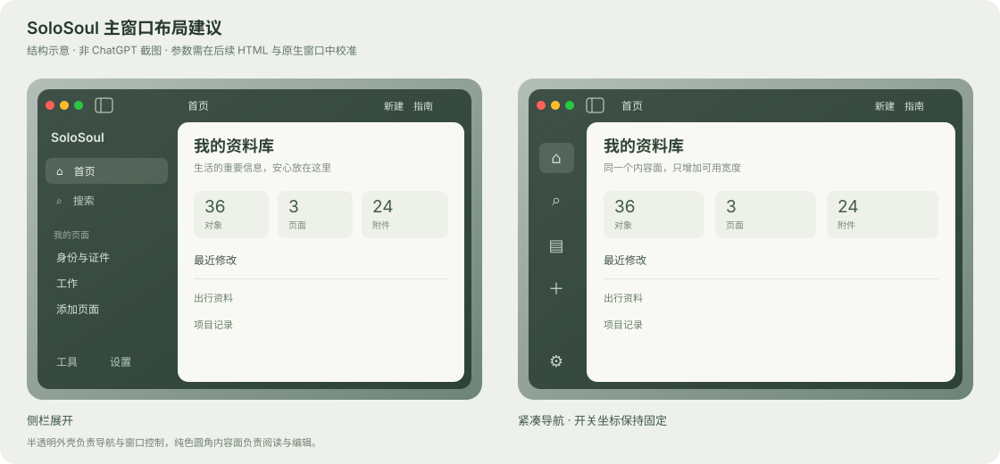

# ChatGPT Desktop 主界面布局调研与 SoloSoul 设计建议

> 调研日期：2026-10-07。对象：macOS 桌面主窗口。性质：设计研究与改造建议，未实施客户端变更。

你喜欢的布局可以归纳为三个关系：**侧边栏与交通灯所在顶栏组成连续的半透明窗口外壳；主内容区是一块完整的纯色圆角表面；侧栏开关属于窗口顶部控制区，展开与收起时保持可见。** 对 SoloSoul 最有价值的是这三个关系共同建立的层次和操作稳定性。

建议 SoloSoul 在第二轮前端重构中先确定主窗口几何，再实施玻璃着色。只调高透明背景的填色强度，仍不能解决内容面边界不统一、侧栏开关随品牌行移动等布局问题。已讨论的背景 90%、登录卡片 80% 可以保留；登录页和解锁后的主界面采用不同的内容表面规则。

## 1 版本与证据范围

本机 `/Applications/ChatGPT.app/Contents/Info.plist` 显示版本 `26.1002.52244`、build `13536`、bundle ID `com.openai.codex`。这是本机安装版本，不代表已核实所有发布渠道的最新版本。官方资料说明，2026-07-09 Codex 已并入 macOS / Windows 的 ChatGPT Desktop，并保留独立的编码体验，因此不同入口的主体内容会不同。[官方更新说明](https://learn.chatgpt.com/docs/whats-new)

电脑操作工具禁止读取本机 ChatGPT 应用界面，本次没有绕过限制截取实机画面。你描述的新版圆角、半透明区域和按钮位置作为本次设计分析的输入；官方资料用于核实产品能力与历史公开图。**本报告不宣称测量了新版的圆角、间距、透明度、动画时长，也不认定它一定使用 NSGlassEffectView。** 半透明外观本身不能证明具体材质 API。

| 依据 | 可以确认 | 不用于确认 |
| --- | --- | --- |
| 用户对新版主界面的观察 | 圆角内容区、侧栏 / 顶栏半透明、内容纯色、开关靠近交通灯的设计方向 | 所有平台、主题、窗口状态均相同 |
| 本机 Info.plist | 安装版本与构建号 | 已安装最新版，或具体界面像素 |
| 官方桌面应用与项目文档 | 桌面工作区支持聊天、项目和文件等组织方式 | 材质源码、圆角数值与内部布局实现 |
| 官方历史公开界面图 | 对应历史画面中的结构关系 | 2026-10 新版的完整外观与交互 |
| SoloSoul 当前源码 | 已有布局、位置与样式约束 | 未运行的原生效果与性能 |

官方项目文档将项目和聊天用于持续组织工作，提供置顶、搜索和归档等入口。这能支持“侧栏承载持久导航”的功能判断，而不构成其透明度或布局数值的证据。[Projects and chats](https://learn.chatgpt.com/docs/projects)

## 2 可核实的公开界面参考

官方 2026-02-02 的 Codex 发布介绍包含[主窗口参考图](https://learn.chatgpt.com/images/codex/app/codex-app-basic-light.webp)：左侧导航呈淡色环境表面，右侧内容明显更白，列表条目以行而非独立卡片呈现。该图说明这种导航 / 内容分工在历史版本中已存在，不能作为本次最新前端更新的截图。[对应官方发布记录](https://learn.chatgpt.com/docs/changelog#february-2026)

官方 2026-04-16 的[浏览器工作区参考图](https://learn.chatgpt.com/images/codex/app/in-app-browser-light.webp)显示顶部交通灯右侧有布局控制图标；主体可分为对话与浏览器两块工作区域。该图的侧栏处于收起状态，可用于观察窗口控制与工作内容的分工，不能证明最新版展开时的开关位置或行为。[对应官方发布记录](https://learn.chatgpt.com/docs/changelog#april-2026)

官方快捷键文档提供 macOS `⌘B` 切换侧栏，也提供字号调整和布局切换入口。可借鉴的是：鼠标入口之外保留键盘操作，侧栏显示状态属于可切换的布局状态。[Commands](https://learn.chatgpt.com/docs/reference/commands)

## 3 你描述的新版布局为何有效

以下是对所述结构的设计分析，不是 OpenAI 公布的设计意图。

### 3.1 半透明外壳承载导航和窗口操作

侧栏回答“我在哪、可以去哪里”，顶部窗口控制区回答“如何管理这个窗口”。两者是持续存在的环境层，使用相同或接近的半透明底色，有助于把它们识别为同一个外壳。

主内容区承担阅读、输入和编辑，使用纯色后不会随桌面背景改变对比。玻璃面积被限制在外围，窗口仍具有 macOS 材质感，正文也能保持稳定。这里更值得借鉴的是功能分层；不需要让每个按钮、每张内容卡片都额外模糊或反光。

### 3.2 圆角内容面让边界自然出现

纯色矩形与半透明外壳之间产生明度差；圆角和少量外沿留白进一步说明“这是工作内容”。这样即使没有明显分隔线，侧栏与正文仍能区分。

圆角应属于整个内容面，内部标题、工具、列表和滚动区共享该表面。若每一段都拥有独立底色、边框和圆角，视觉上会变成层层套盒。对 SoloSoul，目标是一块完整工作区，其内部卡片再按业务需要分组。

### 3.3 侧栏开关靠近交通灯形成稳定入口

把开关放在交通灯右侧，能将窗口控制与布局控制集中在同一条顶栏。用户不必在侧栏品牌行、首个导航项和内容区域之间寻找展开按钮。

建议开关由窗口外壳持有，不随侧栏内容卸载；收起后只改变图标语义和 `aria-expanded`。它既不能落入拖拽命中区，也不应因侧栏宽度动画而移动。上述是 SoloSoul 的实现建议，最新版 ChatGPT 的实际坐标与动画尚未测量。

### 3.4 行式导航减少视觉负担

历史官方图中的侧栏条目主要靠文字、分组和行反馈表达关系。对 SoloSoul，可将“我的页面”视为用户内容，“工具”视为功能，“设置 / 账户”视为全局入口，各组使用间距和轻量标题区分。

普通条目保持平面；悬停给轻底色，选中给更明确的底色或强调标记。更多操作可在悬停、键盘焦点或选中时出现，避免整列图标始终竞争注意力。长名称、数量和状态应各占稳定位置，不能通过改变条目宽度或缩放图标表达悬停。

### 3.5 收起侧栏只改变导航占用空间

理想的收起过程保持顶栏控制、字号和图标大小稳定，主内容面随导航宽度连续调整。主内容无需卸载重建，滚动位置与业务状态也应保留。

ChatGPT 以会话为核心，SoloSoul 还需要高频切换对象页面与工具，不能直接假定完全隐藏侧栏最合适。可比较“完全隐藏”和“保留紧凑导航轨道”两种方案；第一版建议保留 SoloSoul 当前紧凑轨道能力，只固定顶部开关位置。

## 4 与 SoloSoul 当前实现的差异

依据本机 `main` / `8ccb7b38` 源码。本节是静态分析，不将代码规则当作原生合成验收。

| 区域 | 当前实现 | 建议方向 |
| --- | --- | --- |
| 主内容面 | macOS `.main` 根据导航位置铺设底色，尚无统一内缩圆角内容面；Windows 已有部分留白和圆角规则 | macOS 单独定义完整内容表面，避免直接套用 Windows 几何 |
| 顶栏 | AppBar 为 fixed；macOS compact 状态在原生材质有效时透明，位置由侧栏宽度和交通灯避让计算 | 明确窗口顶栏与页面内容的边界，合并几何来源，避免单独调色造成两段材质 |
| 侧栏开关 | 位于 `SideNavigation` 品牌行，在图标 / SoloSoul 名称旁，随侧栏呈现 | 移到顶栏交通灯右侧，展开和收起共用一个入口 |
| 侧栏宽度 | 默认展开至少 232px，折叠至少 96px，左侧进一步避让交通灯 | 新按钮布局后重新核对命中区和宽度约束，不直接取消已有最小宽度保护 |
| 正文滚动与浮层 | `.content` 是滚动容器；通知、尺标等读取真实正文几何，侧栏浮层有既有定位策略 | 改变内容面留白后同步几何，不用额外 transform 把页面整体挪进去 |
| 按钮材质 | macOS 普通按钮已收敛为平面，玻璃集中在少量导航 / 操作表面 | 保留当前按钮方向，不反向把按钮全部玻璃化 |

主要入口：[AppShell](../tauri/src/components/layout/AppShell.tsx) 与其[布局样式](../tauri/src/components/layout/AppShell.module.css)、[AppBar](../tauri/src/components/layout/AppBar.tsx) 与其[顶栏样式](../tauri/src/components/layout/AppBar.module.css)、[SideNavigation](../tauri/src/components/layout/SideNavigation.tsx) 与其[侧栏样式](../tauri/src/components/layout/SideNavigation.module.css)、[nativeWindow](../tauri/src/lib/nativeWindow.ts)、[macOS 窗口材质](../tauri/src-tauri/src/commands/window/macos.rs)和[原生标题栏](../tauri/src-tauri/src/commands/window/macos_titlebar.rs)。

## 5 SoloSoul 主窗口建议

上图是本报告的 SoloSoul 建议示意，不是 ChatGPT 截图，也不是客户端实现。侧栏收起模式暂采用紧凑轨道。

### 5.1 一个窗口外壳和一个内容面

外壳覆盖全窗口，以现有原生玻璃提供环境感，并使用更深的主题着色。标题栏和侧栏读取同一组外壳 token。主内容是一块纯色圆角表面，放在导航剩余区域，保留少量外沿留白。

优先复用现有约 52px 的 macOS 顶栏高度，将交通灯、侧栏开关、页面标题和必要操作放在同一行；不为这次视觉改造再叠一条空白标题栏。页面确有筛选、分组或编辑工具时，再在纯色内容面内提供业务工具区。

窗口级与页面级控制的职责仍需区分：前者由外壳持有，后者跟随页面变化。这是责任分离，不要求视觉上永远占用两行。

### 5.2 参数起点

**以下全部是 SoloSoul 预览建议，不是 ChatGPT 测量结果。**

| 参数 | 起点 | 调整依据 |
| --- | --- | --- |
| 导航 / 顶栏填色 | 90% | 沿用用户对登录预览的反馈；深浅主题分别校准环境透色 |
| 正文底色 | 不透明 | 保持阅读、编辑与对象字段对比稳定 |
| 主内容圆角 | 12～16px | 与窗口圆角、缩放和实际可用空间协调 |
| 内容面外沿留白 | 8px 起 | 只用于显示边界，不增加大面积背景包裹；窄窗口可缩减 |
| 侧栏展开宽度 | 现有 232px 起 | 根据长页面名与数量评估，不因模仿参考客户端盲目加宽 |
| 侧栏紧凑宽度 | 现有 96px 起 | 验证交通灯右侧新按钮的布局后再决定是否调整 |
| 侧栏开关命中区 | 约 32～36px | 图标大小保持约 18～20px，按钮与交通灯留出间隔 |
| 开关水平位置 | 交通灯实际右沿 + 约 12px 间距 | 使用原生几何回传，不硬编码交通灯占用宽度 |

主内容边界先用底色差、间距与圆角建立；普通模式无需明显描边或大阴影。高对比模式仍应恢复必要轮廓，不能把“减少线条”理解为删除可访问性边界。

### 5.3 登录页采用独立规则

已讨论的登录页没有已解锁正文；可以保留深色半透明底板承托浅色、80% 填色的玻璃登录卡片。解锁后切换到纯色工作内容面。登录面板是一项明确的局部例外，80% 不应扩散到对象详情、历史记录、编辑器等内容组件。

因此两套规则可以共存：外壳着色统一，登录页保留局部玻璃，工作内容保持纯色。参考[登录 HTML 预览](previews/macos-login-glass-review.html)和[第二轮前端报告](REFACTOR_FRONTEND_EXECUTION_REPORT_2026-10-07.md)。

### 5.4 导航位置与收起模式

左侧导航最接近用户描述的布局，适合作为第一版评审基准。SoloSoul 已支持右侧、顶部、底部导航，其他位置应沿用相同表面原则，不能为模仿 ChatGPT 删除这些能力。

顶部侧栏开关属于窗口外壳，但在水平导航时没有现成的展开 / 折叠语义，需要明确隐藏、禁用或提供对应操作，避免出现无效按钮。右侧导航也要保持开关可发现，提示文本说明控制的对象。

完全隐藏侧栏会增加正文空间；紧凑轨道保留页面和工具的可发现性。这个选择会改变产品交互，适合用下一份主界面 HTML 比较，而不是在一次按钮挪位里顺带决定。

## 6 前端重构的实施关系

当前第二轮报告的 FE2-002 / FE2-003 覆盖导航着色与顶栏材质，FE2-004 覆盖登录页。这里提出的**圆角纯色主内容面与交通灯右侧固定开关**是新增的布局建议，尚未登记为实施任务，本次不自动改写已建立清单。

建议下一步先做主界面 HTML，展示展开、紧凑轨道与完全隐藏三种状态，同时比较新旧内容边界。确认几何后再把任务拆为外壳布局、开关归属和材质着色，避免实现过程中反复移动控制与叠加背景。

实施时最需保护的四个方面：

1. **窗口命中区。** 开关和页面按钮排除拖拽；交通灯避让使用真实坐标；全屏与缩放后重新核对。
2. **滚动和浮层。** 内容圆角裁剪只作用于内容表面；Portal 菜单不被祖先裁剪。内容留白变化同步通知区、尺标、固定按钮与预览的几何来源。
3. **稳定性。** 侧栏动画不缩放图标、不卸载主页面；保留当前展开状态、焦点与滚动状态。切回首页或窗口恢复时不重新堆叠材质层。
4. **平台边界。** macOS 外壳样式限定平台作用域，Windows 保留 Mica 与既有内容表面，Android 保留移动导航与触控尺寸。公共结构改动仍须检查所有平台。

原生窗口透明背景 alpha `0.001` 的既有防闪黑措施应保留。导航 90% 填色是视觉覆盖层的参数，不是修改原生窗口背景 alpha 的理由。该重构需要真实 macOS 恢复验证，浏览器 HTML 不能证明无闪黑或系统合成成本。

## 7 调研结论

最适合 SoloSoul 的组合是：**统一半透明导航外壳、完整纯色圆角工作区、固定的顶部侧栏开关、平面按钮反馈。** 圆角用于标识内容面，玻璃用于外壳与少量特定面板，业务卡片靠内容组织建立关系。

这条方向与之前“正文直接作为内容区域”的偏好可以协调：只保留窄小的边界留白，让正文占据侧栏之外的大部分空间，不恢复厚重的背景包裹。登录卡片 80% 的局部玻璃也可保留，不与解锁后的纯色工作区冲突。

最新版实机的精确外观、开关展开 / 收起坐标以及材质 API 仍未核验；本报告足以指导下一份 SoloSoul 布局预览，不能作为像素复刻或客户端原生验收依据。
