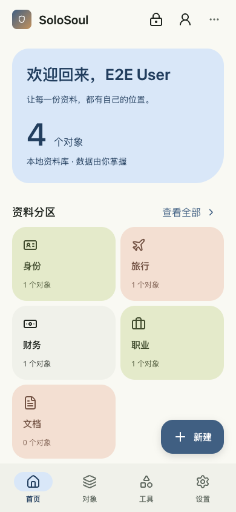
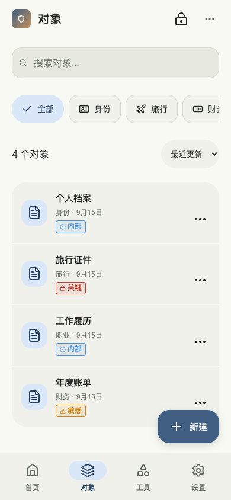
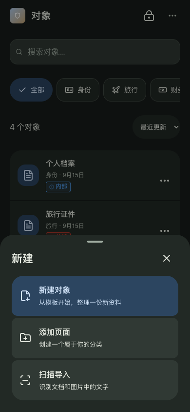

# Android Material 3 Expressive 实施记录

本轮将已确认的原型接入 React / Tauri 客户端。外观由真实 Android 平台标记启用；macOS、Windows 以及桌面窄窗口沿用已有外观。

## 已接入

- 三套手动主题色（雾蓝 / 鼠尾草 / 陶土）、深浅与跟随系统；共享 Card / Button / Input 使用安卓色调表面。
- 64px AppBar，48px 顶部操作区域；手机四入口底栏，大屏 88px 导航轨道。
- 首页概览、五个系统分类、自定义页面与最近五项更新；保留照片集及自定义页面编辑入口。
- 对象列表复用 `/workspace` 的全部对象查询，增加常驻“全部”筛选、名称/更新时间排序、紧凑分组行。
- 字段继续通过现有对象详情及敏感度组件显示；行操作弹层保留历史、附件、编辑、删除与模板同步。
- 工具页复用 `useMobileNavActions` 的现有入口。主动作 FAB 提供新建对象、新建页面、扫描导入，并继承当前分类或页面上下文。
- 新建弹层通过 Portal 展示，隔离背景焦点、支持 Tab / Escape / 安卓返回栈，关闭后恢复焦点。新建页面等待保存与导航成功后再关闭，避免返回栈清理吞掉新路由。
- 减少动态效果通过现有账户偏好、UI 明文偏好与首屏缓存持久化；系统 `prefers-reduced-motion` 同时生效。
- 首页摘要不缓存对象字段内容。锁定后重置摘要缓存，丢弃锁定前迟到的请求结果。

系统壁纸动态取色仍属于后续可选项，本轮使用手动色板。

## 2026-09-16 新建对象归属

- 从首页、工具页或全部对象页新建时，先选择所属页面，再进入仅包含该页模板的编辑器；普通弹层和增强玻璃原生菜单复用此流程。
- 从具体分类或自定义页面新建时自动沿用当前归属，编辑器明确显示“保存到：页面名”。无模板时保留页面归属并引导前往模板管理，不展开其他页面的模板。
- 选择页面使用路由替换，保存或返回仍回到发起页面；编辑器切换归属时重建表单，避免旧字段串入新页面。
- 自定义页面同时写入 `typeId` 与 `parentId`；共享编辑器的旧全局入口也会按模板分类补齐父页面。保存前检查当前页面和模板仍有效、归属一致；不迁移已有对象。

## 实际客户端截图

以下截图来自本轮 React 客户端，以虚构资料和模拟 IPC 拍摄，不是真机截图。

| 首页 | 对象 | 深色新建弹层 |
| --- | --- | --- |
|  |  |  |

## 验证

- TypeScript、ESLint、偏好键白名单对齐与 Rust fmt 通过。Rust UI 偏好默认值、旧配置兼容和序列化往返 3 项测试通过。
- 前端完整单测通过 959 项；新增颜色对比度与平台判定 5 项另行通过。Node 24 的实验性 Web Storage 会干扰 jsdom，测试使用 `NODE_OPTIONS=--no-experimental-webstorage`。
- 浏览器验证覆盖导航图标节点/几何位置稳定、320/360/390/430/768/1024px 无页面横向溢出、手机底栏/平板导航轨道、新建表单焦点与返回栈、分类/搜索/详情掩码、主题与动效偏好重载保持、锁定后内容卸载。
- macOS 外观下的桌面壳、首页返回、工具栏、外观设置回归通过。
- Android ARM64 Debug 构建通过。顺带补齐现有 `NetworkStatusPlugin.kt` 缺失的 `android.app.Activity` 导入，以解除 Kotlin 编译阻断。另修正 `defaultConfig` 的 ABI 合并：`--split-per-abi` 包只携带对应架构，避免混入旧库；universal 仍保留原有双 ARM 范围。

最终调试安装包：`tauri/src-tauri/gen/android/app/build/outputs/apk/arm64/debug/app-arm64-debug.apk`，114.1 MiB。已校验签名，包内原生架构仅 `arm64-v8a`。

当前未连接 Android 设备。系统安全区、软键盘、真实触控、横屏/分屏和系统字体放大的最终体验，仍需使用 Debug APK 真机验收；浏览器测试不能替代这些检查。
