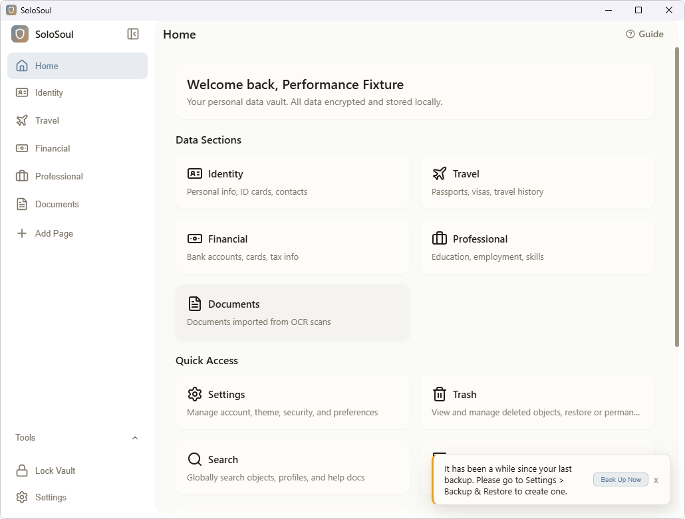

# RF-121 Windows 真实应用完整窗口截图入口

本阶段取得一张1030×781的真实SoloSoul首页截图，包括原生标题栏和按钮、生产Sidebar、内容AppBar及Home Card/CardGrid。与此前仅含WebView的PNG相比，现在具有窗口完整画面；DWM回读SYSTEMBACKDROP_TYPE=2。**这只完成截图入口验证，RF-121仍待验证**：单帧、未知前台状态及未绑定DOM主题/色板不能替代完整材质矩阵。

## 两处临时工具修正

原工具要求同一进程仅有一个可见顶层窗口。实际记录8个所属窗口、2个可见窗口：主窗口客户区1028×749，另一个16×16辅助窗口客户区0×0，带TOOLWINDOW/NOACTIVATE。依据生产配置的decorations/resizable及真实窗口属性，改为仅选唯一的可见、未最小化、未cloaked、root-owner、caption/sysmenu/thickframe、APPWINDOW、非tool/noactivate且客户区为正的主窗口；缺少或多个主候选仍失败。仅对已校验PID/创建时间/EXE的窗口采集详细状态和像素。

首轮主窗口定位通过后，取帧返回HRESULT(0)错误。官方[TryGetNextFrame接口](https://learn.microsoft.com/en-us/uwp/api/windows.graphics.capture.direct3d11captureframepool.trygetnextframe)允许空帧池返回null，windows 0.61.3生成绑定将nullable结果投射为非Option。临时工具改用同一SDK vtable的HRESULT和nullable输出，成功空值只等待、实际失败仍拒绝，五秒预算保持。固定阶段日志证明最终实际收到帧。

捕获使用CreateForWindow及FreeThreaded frame pool、硬件D3D11、BGRA8；仅复制ContentSize范围，捕获前后核验保留的进程句柄、HWND、几何及style。没有读取其他窗口像素、改系统主题/辅助功能或打开正式账户。临时独立Cargo项目使用已缓存SDK，生产Cargo清单和锁文件未改。

## 实际结果与边界

- 原公开100对象驱动保持至少3次、SDK 128调用上限和原50秒阶段/300秒行程预算。四组各3次完整行程均driver exit0；round2/3截图选择失败，round4取帧失败，round5截图exit0。附加截图使这些组仅作诊断，performanceMetrics=null，不作为新性能基线，也不选成功子集代替整组。
- 截图标签light-visible只是文件标签；workspace阶段完成触发截图，实际图像为Home，不能把触发标记当成捕获时路由或主题证明。未记录前台状态、DOM主题和色板；不能据此判定活动Mica颜色、所有文字对比度或恢复无黑帧。
- 临时工具4项测试通过、0失败/忽略，格式、严格all-targets Clippy、构建exit0。空帧和真实错误、辅助窗口、缺失/歧义主窗口及隐藏/minimized/cloaked/无效字段拒绝均覆盖。生产输入1315个文件SHA保持，未重复未受影响的F/R/CLI检查。
- BGRA原件逐字节保留；PNG仅用于查看，部分alpha反预乘有舍入，不声称PNG可还原原始BGRA。PNG块CRC、尺寸、解压像素与转换算法均实际核验。
- fresh CIM复核108个记录身份已退出；只清理96个核验缓存路径、解除12个私有链接，175个根级证明/截图文件通过前后哈希比对；Vault不在删除清单，清理后核对108个文件及哈希；未取得清理前Vault哈希，不能声称其前后逐字节比对；12份日志另行保留，缓存工具未终止进程。原preflight、编译、选择和取帧失败均保留。

## 复核与下一步

[结构化证据](./rf121-windows-composed-capture-2026-10-06.json)绑定GUI/helper EXE SHA、源码、真实检查和窗口身份；[原件索引](./rf121-windows-composed-capture-2026-10-06/index.json)列出366份逐字节原件，单独归档于raw.tar.gz。归档已逐成员解压核验SHA/长度；不含EXE、DLL、模型、Vault实体文件和缓存。原件中的tools/Cargo.toml、Cargo.lock、src/bin/owned-window.rs可在独立临时目录重建工具；原固定路径和owned marker守卫必须保留，不能对正式账户执行。构建命令、五参数调用和退出码均在原始receipt中。

后续在同一隔离应用中绑定实际主题/色板及前台状态，补浅深色、折叠、缩放、隐藏/最小化恢复的稳定帧和黑帧序列。高对比矩阵仍需可恢复的隔离会话，macOS/Android剩余验收保持未完成。RF-112/121/312、RF-122～127前置及278/287关闭数保持；独立本地提交，不推送，整体goal继续active。
